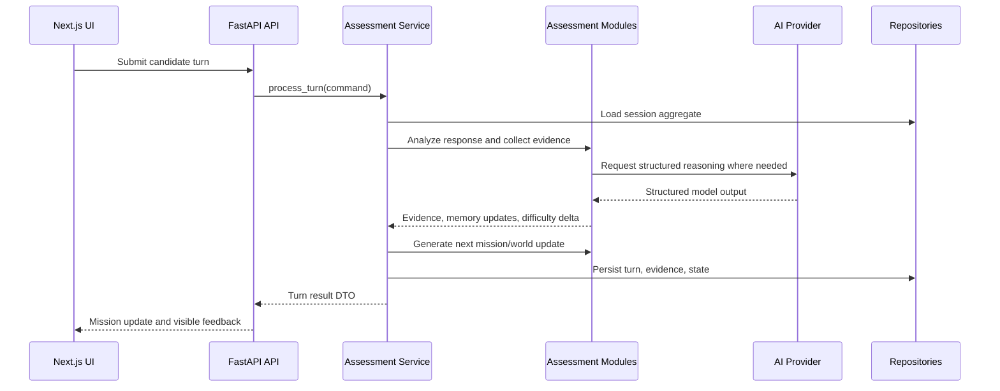

# Architecture

## Architectural Goal

Project Chimera uses Clean Architecture to keep domain logic independent from frameworks, AI providers, persistence, and presentation. FastAPI, SQLAlchemy, Next.js, and AI SDKs are delivery details around a domain core that owns assessment behavior.

## System Style

- Backend: modular monolith first, service-oriented boundaries internally
- Frontend: Next.js application consuming REST APIs
- Data: relational persistence through SQLAlchemy repositories
- AI: provider abstraction with deterministic stub support
- Contracts: Pydantic request, response, and domain DTO models

The modular monolith is intentional. It keeps hackathon implementation velocity high while preserving seams for future service extraction.

## Layers

## Domain Layer

Owns core entities, value objects, scoring concepts, and module contracts.

Responsibilities:

- assessment session lifecycle rules
- mission turn state transitions
- competency and rubric definitions
- evidence model
- hiring recommendation policy inputs

Must not import FastAPI, SQLAlchemy, AI provider SDKs, or frontend code.

## Application Layer

Coordinates use cases across independent modules.

Responsibilities:

- create assessment session
- plan interview mission arc
- process candidate turn
- generate evaluation report
- coordinate repositories and AI providers

This layer depends on domain interfaces and receives concrete adapters through dependency injection.

## Infrastructure Layer

Implements external concerns.

Responsibilities:

- SQLAlchemy repositories
- AI provider clients
- prompt rendering adapters
- logging and observability adapters
- background job adapters when needed

Infrastructure depends inward on application/domain interfaces.

## API Layer

Exposes the FastAPI route and OpenAPI documentation required by the hackathon contract.

Responsibilities:

- request validation
- response shaping
- dependency wiring
- error mapping
- session dispatch through `sessionId`

The public API surface is intentionally one endpoint: `POST /api/interview`. That endpoint calls application services and never infrastructure directly.

## Frontend Layer

Provides the operator and candidate interfaces.

Responsibilities:

- session setup
- mission dashboard
- candidate response input
- evidence and world state visualization
- evaluation report display

The frontend consumes API contracts and does not duplicate scoring logic.

## Module Boundary Rules

Each system module must be independently testable and replaceable:

- Curriculum Analyzer
- Candidate Analyzer
- Interview Planner
- Mission Generator
- World State Engine
- Memory Engine
- Adaptive Difficulty Engine
- Evidence Collector
- Evaluation Engine
- Engineering Profile Generator
- Hiring Recommendation Engine
- Feedback Generator

Rules:

- Modules communicate through typed inputs and outputs.
- Modules do not call each other directly unless orchestrated by an application service.
- Modules do not read from HTTP requests or database sessions.
- Modules return structured outputs with confidence and rationale where applicable.
- AI-backed modules must have deterministic stub behavior for tests.

## Runtime Flow

## Dependency Injection

Dependency injection is used for:

- repositories
- AI provider clients
- clock/time source
- ID generation
- prompt registry
- logging adapters

FastAPI dependency functions provide concrete implementations. Tests can inject in-memory repositories and stub AI providers.

## AI Provider Abstraction

The AI layer exposes provider-neutral interfaces:

- `generate_structured(prompt, schema, options)`
- `embed(texts, options)` when embeddings are needed
- `moderate(text, options)` when safety checks are added

Provider outputs are converted into domain DTOs before returning to application services.

Required providers:

- `StubProvider`: deterministic local behavior for tests and demos without API keys
- `OpenAIProvider`: production AI integration once API keys are configured

## Error Handling Strategy

Errors are classified into:

- validation errors: malformed request or invalid domain command
- not found errors: missing session, mission, or turn
- conflict errors: stale turn sequence, already completed session
- provider errors: AI timeout, invalid structured output, provider unavailable
- persistence errors: database write/read failures
- policy errors: unsafe candidate content or unsupported assessment mode

API responses use consistent error envelopes with trace IDs.

## Observability

Minimum observability:

- structured request logs
- assessment session ID on all logs
- provider latency and failure count
- turn processing duration
- evaluation generation duration
- warning logs for fallback behavior

Future observability:

- trace spans for module orchestration
- audit trail for score changes
- quality dashboards for rubric drift

## Security and Privacy

Initial security posture:

- no secrets committed
- environment-based configuration
- explicit candidate/session IDs
- no prompt or candidate data logged at info level by default
- safe error messages for users
- recommendation outputs include human review language

Future security:

- authentication and role-based access
- encryption at rest for sensitive candidate data
- retention policies
- audit logs for report access

## Fairness Architecture

Fairness is treated as a system property, not a post-processing step.

- Candidate profile analysis is constrained to role-relevant information.
- Adaptive difficulty changes are explicit domain events with rationale.
- Evaluation cannot use hidden demographic or personality claims.
- Recommendation thresholds are configurable by role bar and evidence coverage.
- Candidate-facing feedback is generated from supported evidence summaries, not hidden notes.

## Architecture Self-Review Decisions

The first design risk was over-coupling adaptive modules through direct calls. The refined architecture requires application services to orchestrate modules through typed contracts.

The second risk was AI provider lock-in. The refined architecture requires a provider abstraction and deterministic stub provider before production AI integration.

The third risk was unverifiable scoring. The refined architecture makes evidence the primary object and requires every score and recommendation to cite evidence IDs.

The fourth risk was unfair adaptation. The refined architecture stores adaptation rationale, separates score from confidence, and requires human review when evidence coverage is insufficient.
